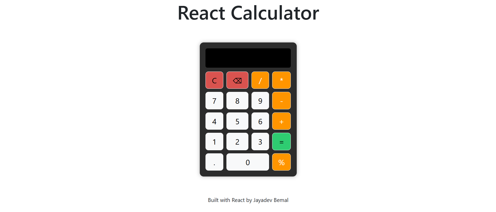

# React Calculator

A simple calculator built using React with modern UI and basic arithmetic operations.

## Live Demo

🔗 [Open Calculator](https://react-calculator-sooty-delta.vercel.app)

## Preview

## Features
- Addition, subtraction, multiplication, division
- Backspace and clear functionality
- Error handling for invalid expressions
- Responsive UI

## Tech Stack
- React
- JavaScript
- CSS Modules
- Bootstrap